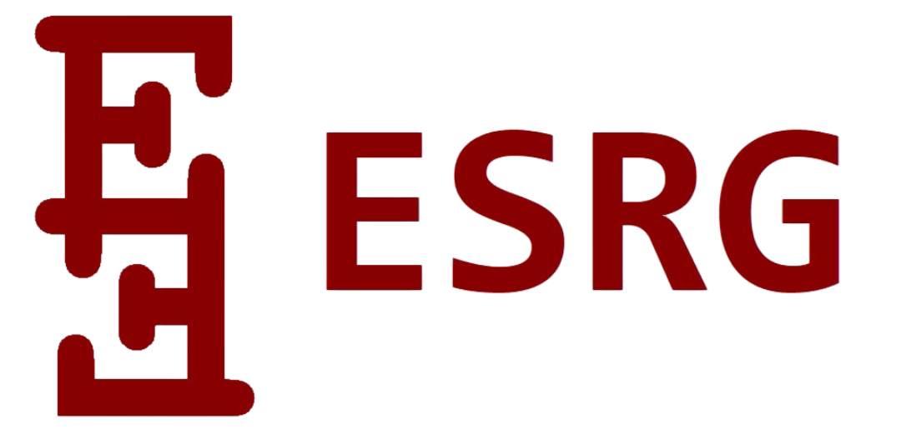
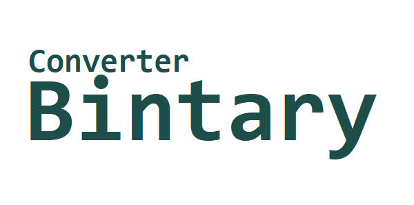
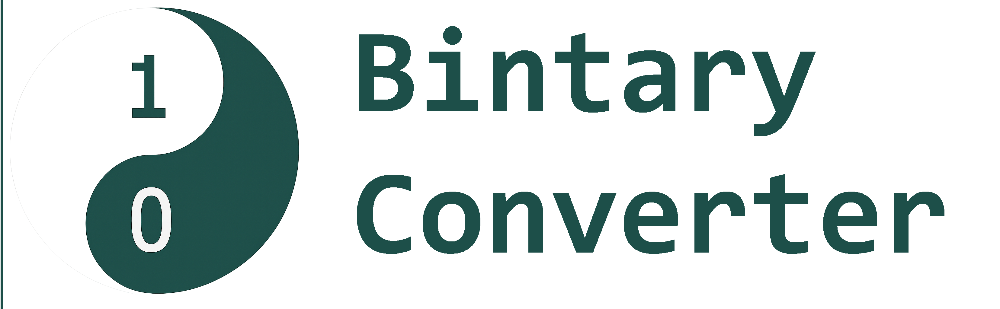

# Catálogo de Recursos y Servicios – ESRG

Este documento presenta de forma estructurada los recursos, servicios y contenidos técnicos desarrollados y ofrecidos por **ESRG**. Su objetivo principal es proporcionar un punto de referencia claro, confiable y actualizado sobre las capacidades y soluciones que se ofrecen en los campos del desarrollo de software, automatización de procesos, generación de contenido digital y apoyo técnico especializado.

El contenido aquí reunido está orientado tanto a colaboradores como a organizaciones, clientes o profesionales que requieran soluciones personalizadas, recursos reutilizables, o deseen conocer el alcance de las contribuciones técnicas disponibles. Asimismo, este archivo actúa como un portafolio dinámico que se actualiza de forma periódica conforme se incorporan nuevas herramientas, servicios o materiales de valor.

Ya sea que busques integrar una herramienta a tu flujo de trabajo, explorar proyectos open source, solicitar un desarrollo a medida, o simplemente conocer más sobre mi enfoque profesional, este espacio está diseñado para facilitar el acceso a dicha información de forma clara y ordenada.

 

&nbsp;&nbsp;&nbsp;&nbsp;&nbsp;&nbsp;&nbsp;&nbsp;&nbsp; **Cada ejecutable lleva consigo una voluntad ajena,**  
&nbsp;&nbsp;&nbsp;&nbsp;&nbsp;&nbsp;&nbsp;&nbsp;&nbsp; **un mandato silente que solo la máquina se atreve a obedecer.**

## RECURSOS Y SERVICIOS

 

 

**Bintary Converter** es una herramienta técnica desarrollada para realizar **conversiones precisas entre números en sistema binario y sistema decimal.** Su diseño minimalista y enfoque funcional lo convierten en una solución eficiente tanto para entornos educativos como profesionales.

El software permite al usuario ingresar un valor en cualquiera de los dos sistemas numéricos y obtener su equivalente de forma inmediata. Su uso es especialmente útil para estudiantes de informática, docentes, desarrolladores y técnicos que requieran validar conversiones numéricas como parte de sus procesos de aprendizaje o trabajo.

Bintary Converter ha sido optimizado para ofrecer un alto rendimiento con una interfaz limpia, sin elementos innecesarios, facilitando una experiencia de uso directa y sin distracciones. Está pensado como una herramienta de consulta rápida, ideal para complementar actividades relacionadas con lógica computacional, arquitectura de computadores y programación de bajo nivel. 

**Repositorio** https://www.repository/BintaryConverter:GitHub.com

|| **VERSIÓN** 1.1.1 Java |
|-|-|
|  **Descargar**  |  https://drive.google.com/file/d/1GO_nuj7LuIYvATlTfIYIix63a6gWg3lV/view?usp=sharing   |
|  **Descargar**  |  https://www.mediafire.com/file/fz50vjkox10jmdn/Bintary_%255BVersi%25C3%25B3n_1.1.1_Java%255D.zip/file   | 
|  **Descargar**  |  https://mega.nz/file/DCQXmaYK#fo24iLe9Q5TAhvDjSUur0OXXHw_hFPALZFLSXUxU3RQ  |

>Archivo .JAR: requiere Java Runtime Environment (JRE) para ejecutarse.

